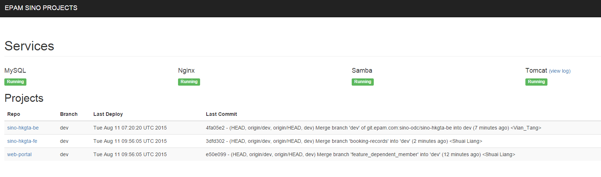
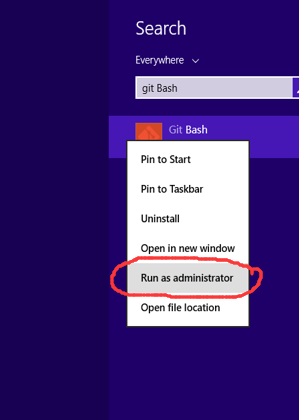
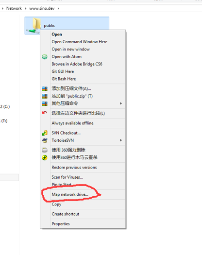
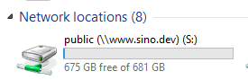

# 项目说明

在此项目可以很方便的看到每个项目是何时部署, 以及部署的版本, 同时还可以看到服务运行的状态(以后可能会加入更多状态参数)

# 使用说明

在使用前首先要修改本地hosts文件.

> 修改本地hosts文件

1. 按`WIN`键, 在搜索框输入git bash
2. 在下拉选项中右击"Git Bash", 选择"Run as administractor", 如下图所示.

3. 在弹出的Git Bash 命令框输入 `echo -e '\n10.22.16.221 local.srv sino.dev www.sino.dev member.sino.dev\n' >> /c/Windows/System32/drivers/etc/hosts` 并且回车
4. 输入 `ping www.sino.dev` 测试验证是否添加host成功

> 访问控制台

`http://www.sino.dev:8000`

> 使用Samba服务器

1. 按`WIN+R` 打开运行窗口, 并且输入`\\sino.dev`
2. 在弹的窗口选择public文件夹, 右键->选择"Map network drive", 然后再在弹出窗口直接点Next 即可.

3. 此时打开"My Computer"即可发现映射好的Driver

